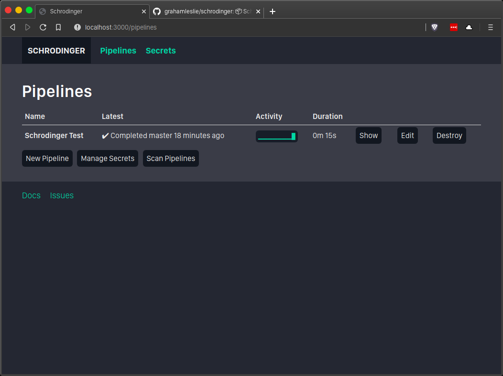

# 📦 Schrodinger [beta]

[](https://hub.docker.com/r/gleslie2008/schrodinger)

**Schrodinger** is a simple CI tool for running your build, test, and deployments in Docker containers.

Run the **Schrodinger** container in your Docker host, create Pipelines to automatically scan your repos for changes, and **Schrodinger** will automatically run them its host's Docker engine.

<center>
    
</center>

## Getting Started

There's a couple steps to get started:

- Install Docker on your host.
- Make sure [`docker` is accessible without sudo](https://askubuntu.com/a/477554).
- [Generate a ssh key pair on your host machine](https://help.github.com/en/github/authenticating-to-github/generating-a-new-ssh-key-and-adding-it-to-the-ssh-agent#generating-a-new-ssh-key) and grant it read access to any repositories you want Schrodinger to build ([GitHub, for example](https://help.github.com/en/github/authenticating-to-github/adding-a-new-ssh-key-to-your-github-account)).
- Add a `Dockerfile.schrodinger` to any repos you've added to a Pipeline to define build/test/deploy.

You can also configure a repo for the sample project, [`schrodinger-test`](https://gitlab.com/gleslie/schrodinger-test). Use the SSH repo, and a `master` trigger.

## Documentation

Documentation is available in the [Schrodinger Wiki](https://github.com/grahamleslie/schrodinger/wiki).

## Installation

Tested on Ubuntu and MacOS.

```bash
docker run \
    -d \
    --name schrodinger \
    -p 80:3000 \
    -e RAILS_LOG_TO_STDOUT=true \
    -e GIT_IDENTITY_FILE=id_rsa \
    -e SCAN_SCHEDULE=5m \
    -e CLEANUP_KEEP_LATEST_RUNS=10 \
    -v $(which docker):/usr/bin/docker \
    -v /var/run/docker.sock:/var/run/docker.sock \
    -v $HOME/.ssh:/app/.ssh:ro \
    -v schrodinger:/persistent/ \
    --privileged=true \
    gleslie2008/schrodinger:latest
```

Ubuntu may require an additional dependency mount:

`-v /usr/lib/x86_64-linux-gnu/libltdl.so.7:/usr/lib/x86_64-linux-gnu/libltdl.so.7`

Editable arguments:

- `-e RAILS_LOG_TO_STDOUT`: if present, **Schrodinger** will log to stdout and be captured in Docker logs.  Remove this if you don't want secrets written to the Docker logs (see Caveats).
- `-e CLEANUP_KEEP_LATEST_RUNS`: if present, deletes any runs older than the latest *N* runs specified.
- `-e GIT_IDENTITY_FILE`: specify the private key file **Schrodinger** should use for cloning repositories with SSH. It should be in `/app/.ssh/` in the container.
- `-e SCAN_SCHEDULE`: how often to re-scan repositories for changes. Defaults to `1m`. See [rufus-scheduler](https://github.com/jmettraux/rufus-scheduler) for syntax.
- `-v $HOME/.ssh:/app/.ssh:ro`: mounts the user's `.ssh` directory in read-only mode. This directory should contain the public and private keys **Schrodinger** will use to clone your repositories.
- `-v schrodinger:/persistent/`: mounts a directory that will be used for storing the sqlite database.

Required arguments:

- `-v /usr/bin/docker:/usr/bin/docker`: mounts the Docker binary.
- `-v /usr/lib/x86_64-linux-gnu/libltdl.so.7:/usr/lib/x86_64-linux-gnu/libltdl.so.7`: mounts a dependency required on Linux systems. Untested on other systems.
- `-v /var/run/docker.sock:/var/run/docker.sock`: mounts the Docker socket, required for communicating with Docker on the host.

## Caveats

It should only be run in a trusted environment with trusted users, because:

- It runs in privileged mode and mounts the Docker socket, so it has control of its Docker host.
- Secrets are stored in plaintext.  They are also logged by default.
- Git host key checking is disabled to automatically accept hosts when cloning repositories.

## Development

- Install Docker.
- Make sure [`docker` is accessible without sudo](https://askubuntu.com/a/477554).
- Clone this repository.
- `rails db:migrate` to run all migrations.
- `rails db:seed` to seed the database.
- `./start.sh` to start the local development server (see file for other tasks run).
